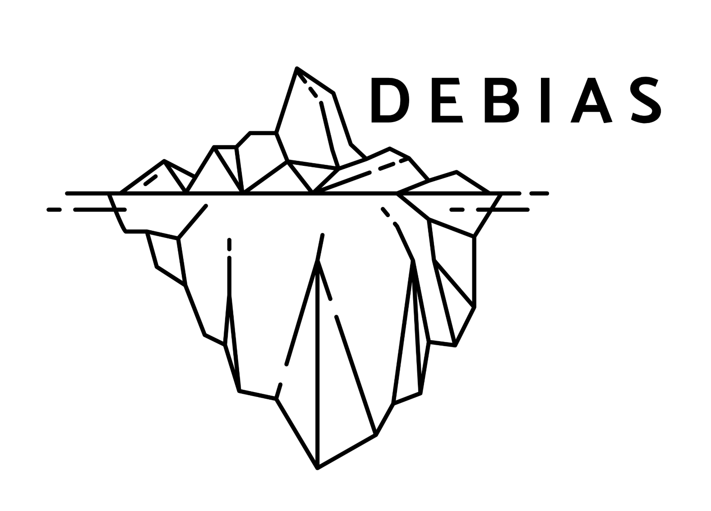

# de-bias Template Repository

Welcome to the de-bias template repository!  

## 🚀 How to Use This Template

1. **Click "Use this template"** at the top of the repository page to create your own project based on this template.
2. **Update project details** such as the title, description, and contact information in this README.
3. **Review and adapt the [CONTRIBUTING.md](CONTRIBUTING.md)** file to match your project's contribution process.
4. **Set up repository features**:
   - Update issue and pull request templates in `.github/ISSUE_TEMPLATE/` and `.github/pull_request_template.md` as needed.
   - Configure the [All Contributors Bot](https://allcontributors.org/) for contributor recognition.
5. **Replace or add your own code, data, and documentation** in the appropriate folders.


## 🛠️ Contributing

We welcome contributions of all kinds—code, documentation, ideas, and more!  
Please read our [Contributing Guidelines](CONTRIBUTING.md) for step-by-step instructions on how to:

- Fork and clone the repository
- Create a new branch for your changes
- Use issue and pull request templates
- Get acknowledged with the All Contributors Bot
- Resolve merge conflicts

If you’re new to open source, our guidelines are designed to make it easy for you to get started.  
If you have questions, open an issue or start a discussion!


## 🙋 License

This repository uses a dual-licensing approach:

- **MIT License** for all software code (see [LICENSE](LICENSE))
- **Creative Commons Attribution 4.0 International (CC BY 4.0)** for documentation, data, and non-code content

See the [LICENSE](LICENSE) file for full details.


## 🗂️ Repository Structure

- `assets/` — Images, diagrams, and other media files
- `.github/` — Community health files (issue/PR templates, workflows)
- `CONTRIBUTING.md` — How to contribute to this project
- `CODE_OF_CONDUCT.md` — Community standards and expectations
- `LICENSE` — Licensing information
- `README.md` — Project overview and instructions


## 🎉 Acknowledging Contributors

We use the [All Contributors Bot](https://allcontributors.org/) to recognize everyone’s work—code, docs, ideas, design, and more.  
After your PR is merged, comment on an issue or PR:

```
@all-contributors please add @your-username for code, doc, etc.
```
(Replace `@your-username` and the contribution types as appropriate.)
See the [emoji key](https://allcontributors.org/docs/en/emoji-key) for available contribution types.

Thank you for helping us build open, collaborative, and impactful projects with Imago!

<!-- ALL-CONTRIBUTORS-LIST:START - Do not remove or modify this section -->
<!-- prettier-ignore-start -->
<!-- markdownlint-disable -->

<!-- markdownlint-restore -->
<!-- prettier-ignore-end -->

<!-- ALL-CONTRIBUTORS-LIST:END -->


